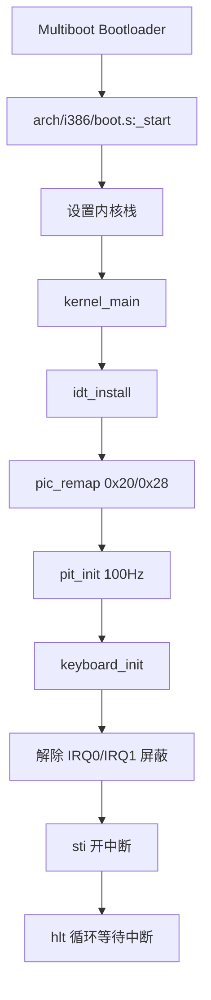

# youOS 架构设计（Phase 1）

## 1. 目标与范围

本文描述 youOS 在 Phase 1 的系统结构，重点覆盖：

- 从引导到内核主循环的启动链路
- 中断与 IRQ 的处理路径
- 当前模块边界与职责
- 设计取舍与后续扩展点

当前版本聚焦最小可运行闭环：时钟中断 + 键盘输入 + VGA 输出。

## 2. 总体分层

```text
+----------------------------------------------------------+
|                     Kernel Services                       |
|            idt / pic / pit / keyboard / terminal         |
+-----------------------------+----------------------------+
|      Arch Glue (i386)       |       Hardware             |
|      boot.s / isr.s         | PIC / PIT / PS2 / VGA      |
+-----------------------------+----------------------------+
|                    Bootloader (Multiboot)                |
+----------------------------------------------------------+
```

分层原则：

- 平台相关代码集中在 arch 目录
- 通用内核逻辑在 kernel 目录
- 设备寄存器访问通过 io.h 统一封装

## 3. 启动链路

### 3.1 启动时序



### 3.2 关键文件

- arch/i386/boot.s: 汇编入口与栈初始化
- kernel/kernel.c: 内核初始化编排
- scripts/linker.ld: 内核镜像段布局

## 4. 中断链路设计

### 4.1 控制流

```mermaid
flowchart TD
    HW[外设触发中断] --> PIC[8259 PIC]
    PIC --> STUB[arch/i386/isr.s IRQ 桩]
    STUB --> CIRQ[kernel/idt.c irq_handler]
    CIRQ --> DISPATCH[handlers[int_no] 分发]
    DISPATCH --> DRIVER[驱动处理函数]
    DRIVER --> EOI[pic_send_eoi]
    EOI --> RET[iretd 返回]
```

### 4.2 异常与 IRQ 分离

- CPU 异常向量：0-31
- 硬件 IRQ 向量：32-47（通过 PIC 重映射得到）

这样可以避免向量冲突，调试时能快速判断是 CPU 异常还是设备中断。

### 4.3 术语与实现对照（面试速查）

#### IDT 是什么

IDT（Interrupt Descriptor Table）是 CPU 的中断向量表。CPU 收到中断号后，会按该号索引 IDT，跳转到对应处理入口。

在本项目中：

- `idt[256]` 与指针结构在 `kernel/idt.c`
- `idt_set_gate` 负责写入门描述符
- `idt_load`（`lidt`）由 `arch/i386/isr.s` 完成

#### PIC 是什么

PIC（8259A）负责把硬件中断线（IRQ0-IRQ15）送给 CPU。

在本项目中：

- 主从 PIC 端口为 `0x20/0x21` 与 `0xA0/0xA1`
- `pic_remap(0x20, 0x28)` 把 IRQ 映射到 32-47
- `pic_set_mask/pic_clear_mask` 控制 IRQ 开关

#### EOI 是什么

EOI（End Of Interrupt）是“本次中断处理完成”的确认信号。不给 EOI，PIC 可能不会继续派发同类后续中断。

在本项目中：

- `irq_handler` 末尾调用 `pic_send_eoi`
- 如果 IRQ 来自从片（IRQ8+），会先给从片发 EOI，再给主片发 EOI

#### PIT 是什么

PIT（Programmable Interval Timer）是定时器芯片，常用于提供系统节拍（tick）。

在本项目中：

- `pit_init(100)` 配成 100Hz
- 分频公式：`divisor = 1193180 / frequency_hz`
- IRQ0 到来时 `pit_ticks++`

#### 键盘输入如何实现

流程是：

1. `keyboard_init` 把 IRQ1 处理函数注册到统一分发表
2. 内核打开 IRQ1 屏蔽位
3. 按键触发 IRQ1
4. 中断里从 `0x60` 端口读取扫描码
5. 过滤“松键”事件（扫描码最高位为 1）
6. 扫描码查表转字符并回显到 VGA

#### “sti” 与 “主循环改为 hlt”是什么意思

- `sti`：设置 IF 标志位，允许 CPU 响应可屏蔽中断。
- `hlt`：让 CPU 进入等待状态，直到下一次中断到来再唤醒。

所以“主循环改为 hlt”的含义是：不忙等空转，而是由中断驱动系统前进。

#### 为什么默认 PIC IRQ 会和 CPU 异常重叠

在 x86 保护模式下，CPU 异常占用向量 `0x00-0x1F`。传统 PIC 默认常把 IRQ 映射到 `0x08-0x0F`，这与异常 `8-15` 区间冲突。

冲突后，调试时很难判断“向量 0x0E”是页故障异常还是某个硬件 IRQ。重映射到 `0x20-0x2F` 可以彻底分离语义。

#### 统一分发接口怎么实现

核心是一个 `handlers[256]` 回调表：

1. 汇编 ISR/IRQ 桩保存现场并把中断号传给 C 层
2. C 层 `isr_handler/irq_handler` 按 `int_no` 查表
3. 若存在 handler 就调用对应驱动逻辑
4. IRQ 路径最后统一发送 EOI

这让“新增设备中断”只需注册回调，避免反复改汇编入口。

## 5. 模块职责

| 模块 | 职责 |
|---|---|
| arch/i386/boot.s | 进入 C 内核前的最小启动流程 |
| arch/i386/isr.s | ISR/IRQ 汇编桩、寄存器入栈与返回 |
| kernel/idt.c | IDT 构建、中断注册与总分发 |
| kernel/pic.c | PIC 初始化、屏蔽控制、EOI |
| kernel/pit.c | PIT 配置与 tick 计数 |
| kernel/keyboard.c | PS/2 扫描码读取与字符回显 |
| kernel/kernel.c | 初始化顺序编排，进入 hlt 事件循环 |
| kernel/io.h | x86 端口输入输出封装 |
| kernel/terminal.h + kernel/kernel.c | VGA 文本输出能力 |

## 6. 设计取舍（Why）

### 6.1 为什么先做中断框架

没有中断，内核无法获得时间与输入事件，后续 shell、调度、系统调用都无法成立。
因此优先投入中断底座，确保后续每一层都能复用。

### 6.2 为什么先只开 IRQ0/IRQ1

- 快速形成可观测闭环（tick + 输入）
- 降低未实现设备的干扰
- 便于逐步定位问题

### 6.3 为什么主循环使用 hlt

空闲时 CPU 进入低功耗等待，收到中断再继续执行，符合事件驱动内核模型。

### 6.4 为什么用 handler 注册表

通过向量号注册回调，驱动无需关心汇编入口细节，扩展新设备中断成本更低。

## 7. 当前限制

- 键盘处理为最小实现，未支持 Shift/Ctrl/Alt 状态机
- 终端尚未实现命令行编辑器与 shell 分发
- 异常处理仅最小 panic，寄存器转储信息有限
- 暂无串口日志通道

## 8. 后续扩展建议

Phase 2 建议优先级：

1. 最小 shell（help/clear/ticks/echo）
2. 串口日志（COM1）
3. 异常详细转储
4. 键盘状态机（Shift 大小写、组合键）

这四项可直接提升可演示性与可调试性，且与当前架构兼容。
