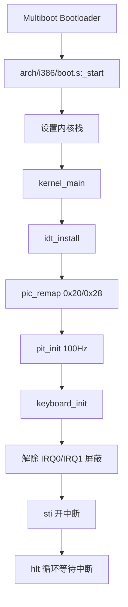

# youOS 架构设计（Phase 1）

## 1. 目标与范围

本文描述 youOS 在 Phase 1 的系统结构，重点覆盖：

- 从引导到内核主循环的启动链路
- 中断与 IRQ 的处理路径
- 当前模块边界与职责
- 设计取舍与后续扩展点

当前版本聚焦最小可运行闭环：时钟中断 + 键盘输入 + VGA 输出。

## 2. 总体分层

```text
+----------------------------------------------------------+
|                     Kernel Services                       |
|            idt / pic / pit / keyboard / terminal         |
+-----------------------------+----------------------------+
|      Arch Glue (i386)       |       Hardware             |
|      boot.s / isr.s         | PIC / PIT / PS2 / VGA      |
+-----------------------------+----------------------------+
|                    Bootloader (Multiboot)                |
+----------------------------------------------------------+
```

分层原则：

- 平台相关代码集中在 arch 目录
- 通用内核逻辑在 kernel 目录
- 设备寄存器访问通过 io.h 统一封装

## 3. 启动链路

### 3.1 启动时序



### 3.2 关键文件

- arch/i386/boot.s: 汇编入口与栈初始化
- kernel/kernel.c: 内核初始化编排
- scripts/linker.ld: 内核镜像段布局

## 4. 中断链路设计

### 4.1 控制流

```mermaid
flowchart TD
    HW[外设触发中断] --> PIC[8259 PIC]
    PIC --> STUB[arch/i386/isr.s IRQ 桩]
    STUB --> CIRQ[kernel/idt.c irq_handler]
    CIRQ --> DISPATCH[handlers[int_no] 分发]
    DISPATCH --> DRIVER[驱动处理函数]
    DRIVER --> EOI[pic_send_eoi]
    EOI --> RET[iretd 返回]
```

### 4.2 异常与 IRQ 分离

- CPU 异常向量：0-31
- 硬件 IRQ 向量：32-47（通过 PIC 重映射得到）

这样可以避免向量冲突，调试时能快速判断是 CPU 异常还是设备中断。

## 5. 模块职责

| 模块 | 职责 |
|---|---|
| arch/i386/boot.s | 进入 C 内核前的最小启动流程 |
| arch/i386/isr.s | ISR/IRQ 汇编桩、寄存器入栈与返回 |
| kernel/idt.c | IDT 构建、中断注册与总分发 |
| kernel/pic.c | PIC 初始化、屏蔽控制、EOI |
| kernel/pit.c | PIT 配置与 tick 计数 |
| kernel/keyboard.c | PS/2 扫描码读取与字符回显 |
| kernel/kernel.c | 初始化顺序编排，进入 hlt 事件循环 |
| kernel/io.h | x86 端口输入输出封装 |
| kernel/terminal.h + kernel/kernel.c | VGA 文本输出能力 |

## 6. 设计取舍（Why）

### 6.1 为什么先做中断框架

没有中断，内核无法获得时间与输入事件，后续 shell、调度、系统调用都无法成立。
因此优先投入中断底座，确保后续每一层都能复用。

### 6.2 为什么先只开 IRQ0/IRQ1

- 快速形成可观测闭环（tick + 输入）
- 降低未实现设备的干扰
- 便于逐步定位问题

### 6.3 为什么主循环使用 hlt

空闲时 CPU 进入低功耗等待，收到中断再继续执行，符合事件驱动内核模型。

### 6.4 为什么用 handler 注册表

通过向量号注册回调，驱动无需关心汇编入口细节，扩展新设备中断成本更低。

## 7. 当前限制

- 键盘处理为最小实现，未支持 Shift/Ctrl/Alt 状态机
- 终端尚未实现命令行编辑器与 shell 分发
- 异常处理仅最小 panic，寄存器转储信息有限
- 暂无串口日志通道

## 8. 后续扩展建议

Phase 2 建议优先级：

1. 最小 shell（help/clear/ticks/echo）
2. 串口日志（COM1）
3. 异常详细转储
4. 键盘状态机（Shift 大小写、组合键）

这四项可直接提升可演示性与可调试性，且与当前架构兼容。
